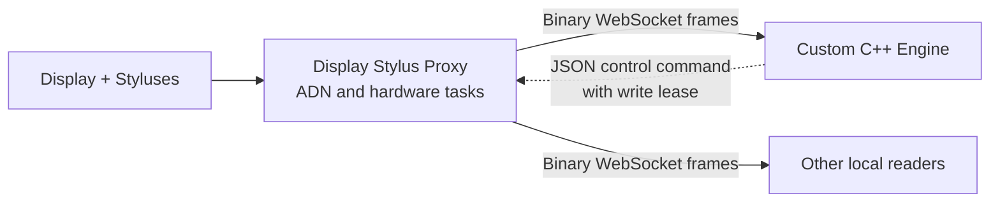
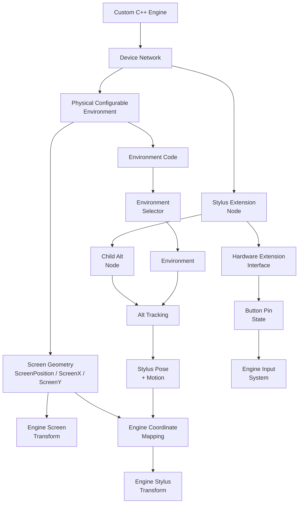

# Display Stylus SDK for Custom C++ Engines

<p align="center">
  <strong>How to integrate Antilatency Display Stylus tracking into a custom C++ engine.</strong>
</p>

<p align="center">
  <a href="https://github.com/antilatency/Antilatency.DisplayStylus.Proxy">Display Stylus Proxy</a>
  &middot;
  <a href="https://developers.antilatency.com/Sdk/Configurator_en.html">SDK Configurator</a>
  &middot;
  <a href="https://github.com/antilatency/Antilatency.DisplayStylus.Unity.SDK">Unity reference SDK</a>
  &middot;
  <a href="https://developers.antilatency.com/Software/Libraries/Antilatency_Device_Network_Library_en.html">Device Network</a>
  &middot;
  <a href="https://developers.antilatency.com/Software/Libraries/Antilatency_Hardware_Extension_Interface_Library_en.html">Hardware Extension Interface</a>
</p>

---

The Display Stylus is built from standard Antilatency parts:

- an **Alt device** provides 6DoF tracking;
- an **Extension Module** provides access to hardware inputs such as the stylus button;
- a **physical configurable environment/display controller** provides the screen geometry and the environment code;
- the generated **Antilatency C++ SDK** already exposes the required low-level libraries.

There are two supported integration models:

- **Proxy mode** keeps Device Network and all hardware tasks in the standalone
  [Display Stylus Proxy](https://github.com/antilatency/Antilatency.DisplayStylus.Proxy)
  process. Your engine receives display and stylus state over a local binary
  WebSocket or HTTP endpoint.
- **Direct ADN mode** loads the generated Antilatency C++ SDK in your process.
  Your engine owns Device Network, discovers nodes, and starts the hardware tasks.

Both models need a small engine-specific layer that connects display geometry,
stylus transforms, and button state to your render and input systems. The
[Unity package](https://github.com/antilatency/Antilatency.DisplayStylus.Unity.SDK)
is a useful reference implementation for both modes, but a custom engine does
not need Unity concepts such as GameObjects, prefabs, or components.

---

## Choose an Integration Mode

| | Proxy mode | Direct ADN mode |
| --- | --- | --- |
| ADN owner | Standalone proxy process | Your engine process |
| Native Antilatency SDK in the engine | Not required | Required |
| Tracking transport | Binary WebSocket or HTTP | Native SDK calls |
| Multiple client processes | Supported | One ADN owner only |
| Device writes | Exclusive, time-limited write lease | Direct SDK calls |
| Best fit | Multiple clients, process isolation, or a portable client layer | Lowest-level control in one process |

Use Proxy mode when more than one application needs the same Display Stylus
state or when hardware ownership should be isolated from the engine. Use Direct
ADN mode when the engine is the only Device Network owner and needs direct
access to native SDK interfaces.

Only one process can own the connected ADN. Do not run Direct ADN mode while
the standalone proxy is active.

---

## Proxy Mode

The proxy owns Device Network, starts the Physical Configurable Environment,
Hardware Extension Interface, and Alt Tracking tasks, and publishes their
results at a fixed loopback endpoint:

```text
http://127.0.0.1:48192
```

Download the executable from the
[latest Display Stylus Proxy release](https://github.com/antilatency/Antilatency.DisplayStylus.Proxy/releases/latest),
start it before the engine, and keep one proxy instance running for all local
clients.



### Reading display and stylus state

Use `ws://127.0.0.1:48192/api/v2/stream` for continuous updates. Each WebSocket
message contains one complete binary snapshot. Use
`GET http://127.0.0.1:48192/api/v2/snapshot` for a one-time snapshot or
diagnostics.

Tracking data is not serialized as JSON. Protocol v2 uses bounded,
little-endian binary messages with IEEE 754 `float32` math values:

- `Vector3`: `x`, `y`, `z` (12 bytes);
- `Quaternion`: `x`, `y`, `z`, `w` (16 bytes);
- `Pose`: position followed by rotation (28 bytes).

A decoded frame can be represented by engine-side types like these:

```cpp
struct DisplayStylusDisplayState {
    bool connected;
    std::optional<std::uint32_t> nodeId;
    std::uint32_t configId;
    std::uint32_t configCount;
    Vec3 screenPosition;
    Vec3 screenX;
    Vec3 screenY;
    Quat environmentRotation;
};

struct DisplayStylusState {
    std::string id;
    std::uint32_t extensionNodeId;
    std::uint32_t trackingNodeId;
    bool connected;
    bool buttonPressed;
    Pose poseEnvironment;
    Vec3 velocityEnvironment;
    Vec3 localAngularVelocity;
    std::string trackingStage;
    float stability;
};

struct DisplayStylusFrame {
    std::int64_t sequence;
    std::uint32_t networkUpdateId;
    std::optional<DisplayStylusDisplayState> display;
    std::vector<DisplayStylusState> styluses;
};
```

Connect the engine's existing networking layer to the stream and publish only
validated, fully decoded frames to gameplay code:

```cpp
void DisplayStylusProxySource::start() {
    _socket.connect("ws://127.0.0.1:48192/api/v2/stream");
}

void DisplayStylusProxySource::onBinaryMessage(std::span<const std::byte> bytes) {
    // Engine helper. Implement it exactly according to Binary Snapshot Protocol v2.
    DisplayStylusFrame next = decodeDisplayStylusSnapshotV2(bytes);

    _latestFrame = std::move(next);
    _connected = true;
}

void DisplayStylusProxySource::onDisconnected() {
    _connected = false;
    _latestFrame.reset();       // Do not leave stale devices in the scene.
    scheduleReconnect();        // Retry while the engine still needs the source.
}
```

The decoder must validate the magic, protocol version, flags, counts, lengths,
UTF-8 strings, total message size, and full payload consumption before exposing
a frame. The first stream frame includes node topology. Later frames may omit
it until `networkUpdateId` changes; cache the last topology if your tools use
node properties, or skip it if the engine only needs display and stylus state.

See
[Binary Snapshot Protocol v2](https://github.com/antilatency/Antilatency.DisplayStylus.Proxy/blob/main/docs/BINARY_PROTOCOL.md)
for the authoritative field order, limits, topology rules, and versioning
policy. The proxy repository remains the canonical source for the wire
protocol and endpoint behavior.

`screenPosition`, `screenX`, `screenY`, `environmentRotation`, stylus poses,
and motion vectors are published in Antilatency Environment space. Apply the
same engine-coordinate mapping described in
[Mapping to Engine Space](#mapping-to-engine-space).

### Reconnection and readiness

Treat transport connectivity and hardware readiness as separate states:

- a connected stream with no display is a valid frame, not a transport error;
- the display is ready when the frame contains a connected display;
- a disconnected stylus must be removed or marked disconnected;
- a stopped proxy, a restarted proxy, and a broken socket should all enter the
  same reconnect loop;
- after reconnecting, replace the cached state with the first new frame.

Do not keep rendering the final pose from a disconnected stream unless your
application deliberately implements a short, visible grace period.

The proxy performs pose extrapolation before publishing a frame. Configure
prediction in the proxy and do not apply the same extrapolation a second time
in the client.

### Keeping the engine API independent

Keep transport and native SDK ownership behind one engine-facing data source.
This lets a project choose Proxy or Direct ADN mode without changing gameplay,
rendering, or input code:

```cpp
enum class DisplayStylusMode {
    Proxy,
    DirectAdn
};

class IDisplayStylusSource {
public:
    virtual ~IDisplayStylusSource() = default;
    virtual void update() = 0;
    virtual bool isConnected() const = 0;
    virtual bool isReady() const = 0;
    virtual const std::optional<DisplayStylusFrame>& latestFrame() const = 0;
};

std::unique_ptr<IDisplayStylusSource> createDisplayStylusSource(
    DisplayStylusMode mode
) {
    if (mode == DisplayStylusMode::Proxy) {
        return std::make_unique<DisplayStylusProxySource>();
    }

    return std::make_unique<DisplayStylusDirectAdnSource>();
}
```

### Writing through the proxy

Readers do not need a lease. A client must acquire the exclusive write lease
before changing an ADN string property or selecting an existing display
configuration. Other readers continue receiving snapshots while the lease is
occupied, but no other client can write.

Control requests are low-frequency JSON. The following transport-neutral
pseudocode shows the complete acquire/write/release lifecycle:

```cpp
auto acquired = http.post(
    "http://127.0.0.1:48192/api/v1/lease/acquire",
    R"({"clientId":"custom-engine-editor","durationSeconds":15})",
    "application/json"
);

if (acquired.status == 423) {
    // Another client currently owns the write channel.
    return;
}

requireSuccess(acquired);
std::string leaseId = parseJson(acquired.body)["lease"]["leaseId"];

// Engine helper. Its callback runs on every exit path from the current scope.
ScopeExit releaseLease([&] {
    http.post(
        "http://127.0.0.1:48192/api/v1/lease/release",
        json({{"leaseId", leaseId}}),
        "application/json"
    );
});

auto changed = http.put(
    "http://127.0.0.1:48192/api/v1/nodes/12/properties/Tag",
    json({{"leaseId", leaseId}, {"value", "Stylus"}}),
    "application/json"
);
requireSuccess(changed);
```

Use URL encoding for the node-property key. A display configuration is selected
with `PUT /api/v1/display/config` and a body containing `leaseId` and
`configId`. This selects an existing configuration; it does not create or edit
a calibration. Renew the lease before it expires when an editing operation
takes longer than the requested duration.

Expected failures return a JSON object with a stable `code` and a readable
`message`. Lease acquisition returns `423 Locked` when another writer owns the
channel. A missing, expired, or released lease returns `409 Conflict` with
`write_lease_required`. Inspect the response body before reporting an error to
the user.

See the
[proxy API documentation](https://github.com/antilatency/Antilatency.DisplayStylus.Proxy#api)
for the current command list, lease lifetime, failure codes, and operational
details instead of duplicating those values in an engine integration.

---

## Why There Is No Universal Engine Wrapper

Every custom engine handles transforms, coordinate systems, rendering latency,
input events, scene hierarchy, and display pivots differently. A small
engine-owned wrapper is therefore still required in either integration mode.

In Direct ADN mode, the generated C++ SDK libraries let you:

- discover Antilatency devices;
- read Physical Configurable Environment data;
- create an Environment from the environment code;
- track the Alt device inside that Environment;
- read the stylus button through the Hardware Extension Interface.

Your engine wrapper should connect these pieces to your own concepts of a display, a stylus object, an input event, and a world transform.

---

## Direct ADN Mode Requirements

Generate an Antilatency SDK subset with the [SDK Configurator](https://developers.antilatency.com/Sdk/Configurator_en.html). At minimum, include these components:

| Component | Why it is required |
| --- | --- |
| **Device Network** | Discovers connected Antilatency devices and gives access to nodes in the device tree. |
| **Physical Configurable Environment** | Connects to the physical environment/display controller and reads screen geometry plus the environment code. |
| **Environment Selector** (`Alt::Environment::Selector`) | Creates an Environment from the environment code returned by the physical environment device. |
| **Alt Tracking** | Starts tracking on the Alt device inside the stylus and returns pose, velocity, angular velocity, and tracking stability. |
| **Hardware Extension Interface** | Reads the stylus button or other pins from the Extension Module. |

You can add other components depending on your application, hardware, tools, and deployment platform.

> [!IMPORTANT]
> AntilatencyService is useful during setup because it can show the node tree, inspect device properties, and help configure devices. It is not required as a parallel runtime for your engine application.
>
> Do not keep AntilatencyService running while your application creates and uses its own Device Network. Only one Device Network should be active for the connected devices at a time.

---

## Direct ADN Architecture



The physical environment/display device provides screen geometry and an environment code. Your application creates the corresponding Environment from that code, uses it to track the child Alt node of each stylus, and maps the resulting pose into your engine coordinates. The screen geometry configures the virtual screen/display transform; the tracked stylus pose configures the virtual stylus transform.

---

## Direct ADN Integration Flow

### 1. Generate and Add the SDK

1. Open the [Antilatency SDK Configurator](https://developers.antilatency.com/Sdk/Configurator_en.html).
2. Select the release, platform, and C++ language binding required by your engine.
3. Include the required components listed above.
4. Add the generated headers, libraries, and runtime binaries to your engine project.
5. Optionally use AntilatencyService during setup to inspect the node tree, check device properties, or configure devices.
6. Close AntilatencyService before running your application.

### 2. Initialize Device Network

Use Device Network as the communication layer between your application and connected Antilatency devices. It lets you inspect nodes, check node status, react to device tree changes, and start tasks through cotask constructors.

Typical engine-side wrapper:

```cpp
struct DisplayStylusRuntime {
    DeviceNetwork::ILibrary deviceNetworkLibrary;
    DeviceNetwork::INetwork network;

    PhysicalConfigurableEnvironment::ILibrary physicalEnvironmentLibrary;
    PhysicalConfigurableEnvironment::ICotaskConstructor physicalEnvironmentConstructor;

    Alt::Environment::Selector::ILibrary environmentSelectorLibrary;
    Alt::Tracking::ILibrary altTrackingLibrary;
    Alt::Tracking::ITrackingCotaskConstructor altTrackingConstructor;

    HardwareExtensionInterface::ILibrary hardwareExtensionLibrary;
    HardwareExtensionInterface::ICotaskConstructor hardwareExtensionConstructor;
};
```

The exact namespace and loading syntax depend on the generated SDK version, so treat the snippets in this README as implementation guidance rather than copy-paste code.

### Runtime lifecycle and errors

Antilatency devices are physical devices, so treat SDK objects as live runtime resources, not as static data. A node can disappear, a task can fail to start, and an already started cotask can finish when the device is disconnected.

Recommended rules:

- Check that every cotask is valid and not finished before reading from it.
- Treat `startTask(...)`, `createInputPin(...)`, `run()`, environment creation, and device-property reads as operations that can fail.
- Use `try/catch` around setup, task start, and recovery code. Do not use exceptions as normal per-frame control flow.
- If startup fails halfway, release every cotask/input pin that was already created.
- If a running cotask finishes, mark the stylus or display as disconnected, release its resources, and return to discovery.
- Use Device Network updates, for example `getUpdateId()`, to know when it is worth repeating discovery.

The exact helper names depend on your wrapper, but the logic should look like this:

```cpp
// Wrapper helper, not an Antilatency SDK function.
// Should check SDK interface validity and then call ICotask::isTaskFinished().
template <typename TCotask>
bool isCotaskAlive(const TCotask& cotask) {
    return cotask != nullptr && !cotask.isTaskFinished();
}

// Wrapper helper, not an Antilatency SDK function.
// Tracking and button polling can be checked independently.
bool isTrackingCotaskAlive(const StylusRuntime& stylus) {
    return isCotaskAlive(stylus.trackingCotask);
}

// Wrapper helper, not an Antilatency SDK function.
// Should verify that the HEI cotask is alive and the input pin interface is valid.
bool isButtonCotaskAlive(const StylusRuntime& stylus) {
    return isCotaskAlive(stylus.extensionCotask) && stylus.buttonPin != nullptr;
}

// Wrapper helper, not an Antilatency SDK function.
// Should verify that the Physical Configurable Environment cotask and Environment are valid.
bool isDisplayEnvironmentAlive(const DisplayEnvironmentRuntime& display) {
    return isCotaskAlive(display.cotask) && display.environment != nullptr;
}
```

The examples below use broad `catch (...)` only to keep the pseudocode short. In production code, catch the exception types exposed by your generated SDK/binding, log the reason, release partially created resources, and retry discovery when Device Network changes.

Useful official references for the examples below:

- [`ITrackingCotask::getExtrapolatedState`](https://developers.antilatency.com/Api/V3_5_1/Antilatency/Alt/Tracking/ITrackingCotask/Methods/getExtrapolatedState_en.html)
- [Antilatency Hardware Extension Interface Library](https://developers.antilatency.com/Software/Libraries/Antilatency_Hardware_Extension_Interface_Library_en.html)
- [`IInputPin::getState`](https://developers.antilatency.com/Api/V4_6_0/Antilatency/HardwareExtensionInterface/IInputPin/Methods/getState_en.html)
- [Antilatency Device Network Library](https://developers.antilatency.com/Software/Libraries/Antilatency_Device_Network_Library_en.html)
- [Antilatency Tracking Minimal Demo C++](https://github.com/antilatency/Antilatency.TrackingMinimalDemoCpp)

### 3. Start the Physical Configurable Environment

Start the Physical Configurable Environment task on the supported display/environment node.

- `getScreenPosition()`
- `getScreenX()`
- `getScreenY()`
- `getConfigId()`
- `getEnvironment(configId)`

The application then creates an Environment from the returned environment code. Keep this as runtime state, because the Physical Configurable Environment cotask and Environment are still useful after initialization.

```cpp
struct DisplayEnvironmentRuntime {
    PhysicalConfigurableEnvironment::ICotask cotask;
    Alt::Environment::IEnvironment environment;

    Vec3 screenPosition;
    Vec3 screenX;
    Vec3 screenY;
};

DisplayEnvironmentRuntime startDisplayEnvironment(DisplayStylusRuntime& runtime) {
    DisplayEnvironmentRuntime result;

    try {
        auto nodes = runtime.physicalEnvironmentConstructor.findSupportedNodes(runtime.network);

        // Wrapper helper, not an Antilatency SDK function.
        // Should choose an idle node that supports Physical Configurable Environment task.
        auto displayNode = findFirstIdleNode(runtime.network, nodes);

        if (displayNode == DeviceNetwork::NodeHandle::Null) {
            return result;
        }

        result.cotask =
            runtime.physicalEnvironmentConstructor.startTask(runtime.network, displayNode);

        result.screenPosition = result.cotask.getScreenPosition();
        result.screenX = result.cotask.getScreenX();
        result.screenY = result.cotask.getScreenY();

        auto configId = result.cotask.getConfigId();
        auto environmentCode = result.cotask.getEnvironment(configId);
        result.environment = runtime.environmentSelectorLibrary.createEnvironment(environmentCode);
    } catch (...) {
        // Wrapper helper, not an Antilatency SDK function.
        // Should safely release result.cotask and clear result.environment.
        releaseDisplayEnvironment(result);
    }

    return result;
}
```

Keep the Physical Configurable Environment cotask alive while the physical environment/display device is connected. Screen geometry is usually read when the task starts or after a device/network update. The environment rotation should not be returned as a cached field from `startDisplayEnvironment(...)`.

If the created Environment supports orientation awareness, query the orientation-aware environment interface (`IOrientationAwareEnvironment`) and call `getRotation()` whenever your engine needs the current Environment rotation.

```cpp
Quat getEnvironmentRotation(const DisplayEnvironmentRuntime& display) {
    // Wrapper helper, not an Antilatency SDK function.
    // Should QueryInterface/cast display.environment to IOrientationAwareEnvironment when supported.
    auto orientationAware = queryOrientationAwareEnvironment(display.environment);

    if (!orientationAware) {
        return Quat::identity();
    }

    return orientationAware.getRotation();
}
```

## Display Geometry

`ScreenPosition`, `ScreenX`, and `ScreenY` describe the physical screen in Environment space.

`ScreenPosition` is the offset from the Environment coordinate origin to the screen. This is needed because the physical markers can be located around the device in one place, while the actual screen center or screen coordinate frame can be in another place. Use this offset to connect tracking data from the Environment to the virtual screen in your engine.

| Value | Meaning |
| --- | --- |
| `ScreenPosition` | Offset from the Environment origin to the screen coordinate frame, in meters. |
| `ScreenX` | X half-axis vector of the screen. Its magnitude is half of the screen width in meters. |
| `ScreenY` | Y half-axis vector of the screen. Its magnitude is half of the screen height in meters. |

The values are vectors, not only scalar sizes. Their directions matter.

```cpp
struct DisplayGeometry {
    Vec3 screenPosition;
    Vec3 screenX;
    Vec3 screenY;

    Vec3 xAxis() const { return normalize(screenX); }
    Vec3 yAxis() const { return normalize(screenY); }
    Vec3 zAxis() const { return normalize(cross(xAxis(), yAxis())); }

    float halfWidthMeters() const { return length(screenX); }
    float halfHeightMeters() const { return length(screenY); }
};
```

All values are in meters. Avoid applying hidden scale transforms unless your engine wrapper converts every value consistently.

---

## Stylus Discovery

A stylus is normally represented as an Extension Module node with a child Alt node:

- the **Extension Module** handles the button or other hardware inputs;
- the child **Alt** handles position and rotation tracking.

For the ready Antilatency stylus, the extension node still works through the Hardware Extension Interface, but it should be selected by its hardware name. The Unity reference searches Hardware Extension Interface-supported nodes, picks an idle node whose `HardwareName` contains `AntilatencyStylusAlpha`, then finds the Alt node whose parent is that extension node.

In Unity this is done one stylus at a time when Device Network update id changes. For a custom engine README, it is clearer to show the same logic as a function that returns all currently available stylus device pairs.

```cpp
struct StylusDevice {
    DeviceNetwork::NodeHandle extensionNode;
    DeviceNetwork::NodeHandle altNode;
};

std::vector<StylusDevice> findAvailableStylusDevices(DisplayStylusRuntime& runtime) {
    std::vector<StylusDevice> result;

    try {
        auto extensionNodes = runtime.hardwareExtensionConstructor.findSupportedNodes(runtime.network);
        auto altNodes = runtime.altTrackingConstructor.findSupportedNodes(runtime.network);

        for (const auto& extensionNode : extensionNodes) {
            // Antilatency SDK call: INetwork::nodeGetStatus(...).
            // Only idle nodes can be used to start a new stylus task.
            if (runtime.network.nodeGetStatus(extensionNode) != DeviceNetwork::NodeStatus::Idle) {
                continue;
            }

            // Antilatency SDK call: INetwork::nodeGetStringProperty(...).
            // Use the HardwareName property key from your generated DeviceNetwork headers.
            auto hardwareName = runtime.network.nodeGetStringProperty(
                extensionNode,
                DeviceNetwork::Interop::Constants::HardwareNameKey
            );

            if (hardwareName.find("AntilatencyStylusAlpha") == std::string::npos) {
                continue;
            }

            StylusDevice stylusDevice;
            stylusDevice.extensionNode = extensionNode;

            // Wrapper helper, not an Antilatency SDK function.
            // Should find an Alt Tracking node whose parent is stylusDevice.extensionNode.
            // The parent check is done with INetwork::nodeGetParent(...).
            stylusDevice.altNode =
                findChildAltNode(runtime.network, altNodes, stylusDevice.extensionNode);

            if (stylusDevice.altNode == DeviceNetwork::NodeHandle::Null) {
                continue;
            }

            result.push_back(stylusDevice);
        }
    } catch (...) {
        result.clear();
    }

    return result;
}
```

Your application can call this when Device Network update id changes, then start tasks for the returned devices that are not already managed by your engine.

```cpp
void refreshStyluses(DisplayStylusRuntime& runtime, const Alt::Environment::IEnvironment& environment) {
    auto devices = findAvailableStylusDevices(runtime);

    for (const auto& device : devices) {
        // Wrapper helper, not an Antilatency SDK function.
        // Should prevent starting duplicate tasks for the same extension/Alt pair.
        if (isAlreadyManaged(device)) {
            continue;
        }

        auto stylus = startStylus(runtime, device, environment);
        if (isTrackingCotaskAlive(stylus) && isButtonCotaskAlive(stylus)) {
            addManagedStylus(stylus);
        }
    }
}
```

Multiple styluses can be connected. Your wrapper should repeat this discovery flow for every idle stylus extension node that should be controlled by the application.

---

## Starting Stylus Tasks

Start two tasks for each stylus:

1. **Hardware Extension Interface task** on the extension node.
2. **Alt Tracking task** on the child Alt node, using the Environment created from the display environment code.

For a typical stylus button, start the Hardware Extension Interface task, create the required input pin, call `run()`, and read the pin state.

```cpp
StylusRuntime startStylus(
    DisplayStylusRuntime& runtime,
    const StylusDevice& device,
    const Alt::Environment::IEnvironment& environment
) {
    StylusRuntime stylus;

    try {
        stylus.extensionCotask =
            runtime.hardwareExtensionConstructor.startTask(runtime.network, device.extensionNode);

        stylus.buttonPin =
            stylus.extensionCotask.createInputPin(HardwareExtensionInterface::Interop::Pins::IO1);

        stylus.extensionCotask.run();

        stylus.trackingCotask =
            runtime.altTrackingConstructor.startTask(runtime.network, device.altNode, environment);
    } catch (...) {
        // Wrapper helper, not an Antilatency SDK function.
        // Should safely release input pin, HEI cotask, and tracking cotask if they were created.
        releaseStylus(stylus);
    }

    return stylus;
}
```

> [!NOTE]
> Validate the button pin and pressed state against your hardware revision. One common configuration uses `IO1` and considers `PinState.Low` pressed.

---

## Polling Stylus Pose

Poll the stylus pose as late as possible before rendering. This reduces the visible mismatch between the physical stylus and the rendered stylus.

A common pattern is to read tracking state in the last possible engine update stage before render submission and use `getExtrapolatedState(...)` with an extrapolation time tuned for your display pipeline. This is independent from button polling.

```cpp
struct StylusPoseSample {
    int id;
    bool connected;
    Pose poseWorld;
    Vec3 velocityWorld;
    Vec3 angularVelocity;
    TrackingStability stability;
};

StylusPoseSample pollStylusPoseBeforeRender(
    StylusRuntime& stylus,
    const DisplayEnvironmentRuntime& display,
    float extrapolationTimeSeconds
) {
    StylusPoseSample result;
    result.id = stylus.id;

    // Wrapper helper, not an Antilatency SDK function.
    // Should return false when trackingCotask is null/invalid or isTaskFinished().
    result.connected = isTrackingCotaskAlive(stylus);
    if (!result.connected) {
        return result;
    }

    // Wrapper helper, not an Antilatency SDK function.
    // Should return the placement of the Alt in stylus-local coordinates.
    // If your engine treats the Alt pose as the stylus pose directly, this can be identity placement.
    auto trackingPlacement = getStylusTrackingPlacement(stylus);

    // Antilatency SDK call:
    // ITrackingCotask::getExtrapolatedState(Antilatency::Math::floatP3Q placement, float deltaTime)
    auto trackingState =
        stylus.trackingCotask.getExtrapolatedState(trackingPlacement, extrapolationTimeSeconds);

    // Wrapper helpers, not Antilatency SDK functions.
    // They should convert Antilatency coordinates/units into your engine world space.
    result.poseWorld = convertPoseToEngineSpace(trackingState.pose, display);
    result.velocityWorld = convertVectorToEngineSpace(trackingState.velocity, display);
    result.angularVelocity =
        convertAngularVelocityToEngineSpace(trackingState.localAngularVelocity, display);
    result.stability = trackingState.stability;

    return result;
}
```

The extrapolation value should match your display and rendering latency. Larger values predict farther into the future but can become less accurate.

---

## Mapping to Engine Space

There is no single correct transform formula for every engine. The right mapping depends on:

- your coordinate handedness;
- your unit scale;
- the display pivot;
- whether the virtual display is tilted or rotated;
- whether the screen is parented under another scene object;
- whether you render the stylus in display-local space or world space.

A common starting point is to build one screen/display transform and use it for the stylus pose. The rotation in that transform should be whatever your engine uses for the virtual screen. If you want the virtual screen to follow the physical screen or marker-structure tilt, this rotation can come from `getEnvironmentRotation(display)`. Do not apply the same Environment rotation again later.

The example below treats `displayWorldPosition` as the world position of your virtual display object. `ScreenPosition` is added because it is the offset from the Environment origin to the screen.

```cpp
Vec3 displayWorldPosition = getDisplayWorldPosition();

// Wrapper helper, not an Antilatency SDK function.
// Should return the final rotation of your virtual screen in engine world space.
// It may be a fixed engine rotation, or getEnvironmentRotation(display), or a composition chosen by your engine.
Quat screenWorldRotation = getScreenWorldRotation(display);

// Wrapper helper, not an Antilatency SDK function.
// Should return the offset from the screen coordinate frame to your chosen screen pivot.
// Example: zero for ScreenPosition pivot, screenY for bottom-center pivot.
Vec3 screenPivotOffset = getScreenPivotOffset(screenX, screenY);

Vec3 screenOffset =
    screenPosition + screenPivotOffset;

Vec3 localStylusPosition =
    screenOffset + stylusPose.position;

Vec3 worldStylusPosition =
    displayWorldPosition + screenWorldRotation * localStylusPosition;

Quat worldStylusRotation =
    screenWorldRotation * stylusPose.rotation;
```

For example, if you decide that the virtual screen should follow the current Environment rotation:

```cpp
Vec3 displayWorldPosition = getDisplayWorldPosition();
Quat screenWorldRotation = getEnvironmentRotation(display);

Vec3 screenPivotOffset = getScreenPivotOffset(screenX, screenY);

Vec3 screenOffset =
    screenPosition + screenPivotOffset;

Vec3 localPosition =
    screenOffset + stylusPose.position;

Vec3 worldPosition =
    displayWorldPosition + screenWorldRotation * localPosition;

Quat worldRotation =
    screenWorldRotation * stylusPose.rotation;
```

The important part is to have one clear transform chain. If the virtual screen transform already contains Environment rotation, do not multiply by Environment rotation again when placing the stylus.

---

## Suggested Engine-Side API

A small wrapper is usually enough. Keep the engine-facing API simple and stable.

### Display data

```cpp
struct DisplayStylusDisplayData {
    Vec3 screenPositionMeters;
    Vec3 screenXHalfAxisMeters;
    Vec3 screenYHalfAxisMeters;
};

class DisplayStylusDisplay {
public:
    const DisplayStylusDisplayData& geometry() const;

    // Read on demand from the orientation-aware environment when needed.
    Quat getEnvironmentRotation() const;

private:
    PhysicalConfigurableEnvironment::ICotask _physicalEnvironmentCotask;
    Alt::Environment::IEnvironment _environment;
};
```

### Stylus pose state

```cpp
struct StylusPoseSample {
    int id;
    bool connected;
    Pose poseWorld;
    Vec3 velocityWorld;
    Vec3 angularVelocity;
    TrackingStability stability;
};
```

### Polling button state

```cpp
struct StylusButtonSample {
    int id;
    bool connected;
    bool pressed;
};

StylusButtonSample pollStylusButton(StylusRuntime& stylus) {
    StylusButtonSample result;
    result.id = stylus.id;

    // Wrapper helper, not an Antilatency SDK function.
    // Should return false when extensionCotask/input pin is null/invalid
    // or when the HEI cotask isTaskFinished().
    result.connected = isButtonCotaskAlive(stylus);
    if (!result.connected) {
        result.pressed = false;
        return result;
    }

    // Antilatency SDK call: IInputPin::getState().
    // The "pressed" mapping is hardware-specific. IO1 + Low is one common configuration.
    result.pressed =
        stylus.buttonPin.getState() == HardwareExtensionInterface::Interop::PinState::Low;

    return result;
}
```

Poll only the data your engine needs at that point. For example, poll only the button state for input handling and only the pose before rendering. If your input system needs press/release/click events, derive them by comparing the current polled button state with the previous one. This keeps disconnect handling explicit in your engine instead of hiding it inside a callback contract.

`IInputPin::getState()` reads the latest pin state. Choose the polling cadence according to your engine input loop and the hardware update rate.
