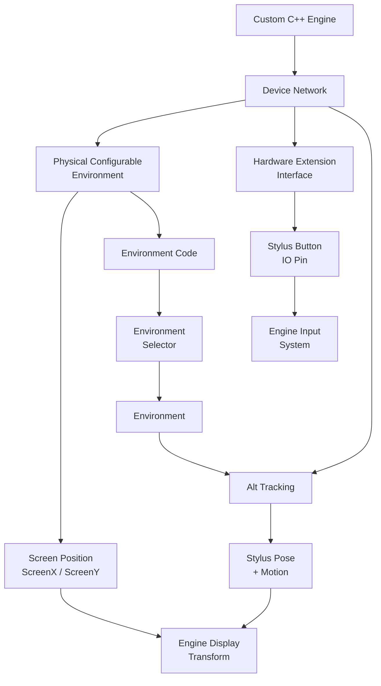

# Display Stylus SDK for Custom C++ Engines

<p align="center">
  <strong>How to integrate Antilatency Display Stylus tracking into a proprietary C++ engine.</strong>
</p>

<p align="center">
  <a href="https://developers.antilatency.com/Sdk/Configurator_en.html">SDK Configurator</a>
  &middot;
  <a href="https://github.com/antilatency/Antilatency.DisplayStylus.Unity.SDK">Unity reference SDK</a>
  &middot;
  <a href="https://developers.antilatency.com/Software/Libraries/Antilatency_Device_Network_Library_en.html">Device Network</a>
  &middot;
  <a href="https://developers.antilatency.com/Software/Libraries/Antilatency_Hardware_Extension_Interface_Library_en.html">Hardware Extension Interface</a>
</p>

---

The Display Stylus is built from standard Antilatency parts:

- an **Alt device** provides 6DoF tracking;
- an **Extension Module** provides access to hardware inputs such as the stylus button;
- a **physical configurable environment/display controller** provides the screen geometry and the environment code;
- the generated **Antilatency C++ SDK** already exposes the required low-level libraries.

The Unity package is not a separate tracking system. It is a Unity-side wrapper around the same Antilatency SDK libraries. For a proprietary engine, the correct approach is to build a small engine-specific wrapper that connects these libraries to your own render loop, transform system, input system, and asset pipeline.

You can use the Unity package as a reference implementation, but your engine does not need to reproduce Unity concepts such as GameObjects, prefabs, or components:

https://github.com/antilatency/Antilatency.DisplayStylus.Unity.SDK

---

## Why There Is No Universal Engine SDK

Every custom engine handles transforms, coordinate systems, rendering latency, input events, scene hierarchy, and display pivots differently. Because of that, Antilatency cannot provide one prebuilt wrapper that fits every proprietary engine.

What Antilatency can provide is the important part: the C++ SDK libraries that let you:

- discover Antilatency devices;
- read Physical Configurable Environment data;
- create an Environment from the environment code;
- track the Alt device inside that Environment;
- read the stylus button through the Hardware Extension Interface.

Your engine wrapper should connect these pieces to your own concepts of a display, a stylus object, an input event, and a world transform.

---

## Required SDK Components

Generate an Antilatency SDK subset with the [SDK Configurator](https://developers.antilatency.com/Sdk/Configurator_en.html). At minimum, include these components:

| Component | Why it is required |
| --- | --- |
| **Device Network** | Discovers connected Antilatency devices and gives access to nodes in the device tree. |
| **Physical Configurable Environment** | Connects to the physical environment/display controller and reads screen geometry plus the environment code. |
| **Environment Selector** (`Alt::Environment::Selector`) | Creates an Environment from the environment code returned by the physical environment device. |
| **Alt Tracking** | Starts tracking on the Alt device inside the stylus and returns pose, velocity, angular velocity, and tracking stability. |
| **Hardware Extension Interface** | Reads the stylus button or other pins from the Extension Module. |

You can add other components depending on your application, hardware, tools, and deployment platform.

> [!IMPORTANT]
> Use compatible Antilatency SDK and AntilatencyService versions for your target platform. Avoid mixing SDK binaries, generated headers, and service versions from unrelated releases.

---

## Architecture



The physical environment device knows which Environment it represents and controls the IR markers. Your application reads this information, creates the corresponding Environment, and then tracks each stylus Alt inside it.

---

## Integration Flow

### 1. Generate and Add the SDK

1. Open the [Antilatency SDK Configurator](https://developers.antilatency.com/Sdk/Configurator_en.html).
2. Select the release, platform, and C++ language binding required by your engine.
3. Include the required components listed above.
4. Add the generated headers, libraries, and runtime binaries to your engine project.
5. Make sure AntilatencyService installed on the target machine uses the same SDK release family.

### 2. Initialize Device Network

Use Device Network as the communication layer between your application and connected Antilatency devices. It lets you inspect nodes, check node status, react to device tree changes, and start tasks through cotask constructors.

Typical engine-side wrapper:

```cpp
struct DisplayStylusRuntime {
    DeviceNetwork::ILibrary deviceNetworkLibrary;
    DeviceNetwork::INetwork network;

    PhysicalConfigurableEnvironment::ILibrary physicalEnvironmentLibrary;
    PhysicalConfigurableEnvironment::ICotaskConstructor physicalEnvironmentConstructor;

    Alt::Environment::Selector::ILibrary environmentSelectorLibrary;
    Alt::Tracking::ILibrary altTrackingLibrary;
    Alt::Tracking::ITrackingCotaskConstructor altTrackingConstructor;

    HardwareExtensionInterface::ILibrary hardwareExtensionLibrary;
    HardwareExtensionInterface::ICotaskConstructor hardwareExtensionConstructor;
};
```

The exact namespace and loading syntax depend on the generated SDK version, so treat the snippets in this README as implementation guidance rather than copy-paste code.

### 3. Start the Physical Configurable Environment

Start the Physical Configurable Environment task on the supported display/environment node.

- `getScreenPosition()`
- `getScreenX()`
- `getScreenY()`
- `getConfigId()`
- `getEnvironment(configId)`

The application then creates an Environment from the returned environment code. Keep this as runtime state, because the Physical Configurable Environment cotask and Environment are still useful after initialization.

```cpp
struct DisplayEnvironmentRuntime {
    PhysicalConfigurableEnvironment::ICotask cotask;
    Alt::Environment::IEnvironment environment;

    Vec3 screenPosition;
    Vec3 screenX;
    Vec3 screenY;
};

DisplayEnvironmentRuntime startDisplayEnvironment(DisplayStylusRuntime& runtime) {
    auto nodes = runtime.physicalEnvironmentConstructor.findSupportedNodes(runtime.network);
    auto displayNode = findFirstIdleNode(runtime.network, nodes);

    auto cotask = runtime.physicalEnvironmentConstructor.startTask(runtime.network, displayNode);

    DisplayEnvironmentRuntime result;
    result.cotask = cotask;
    result.screenPosition = result.cotask.getScreenPosition();
    result.screenX = result.cotask.getScreenX();
    result.screenY = result.cotask.getScreenY();

    auto configId = result.cotask.getConfigId();
    auto environmentCode = result.cotask.getEnvironment(configId);
    result.environment = runtime.environmentSelectorLibrary.createEnvironment(environmentCode);

    return result;
}
```

Keep the Physical Configurable Environment cotask alive while the physical environment/display device is connected. Screen geometry is usually read when the task starts or after a device/network update. The environment rotation should not be returned as a cached field from `startDisplayEnvironment(...)`.

If the created Environment supports orientation awareness, query the orientation-aware environment interface (`IOrientationAwareEnvironment`) and call `getRotation()` whenever your engine needs the current Environment rotation.

```cpp
Quat getEnvironmentRotation(const DisplayEnvironmentRuntime& display) {
    auto orientationAware = queryOrientationAwareEnvironment(display.environment);

    if (!orientationAware) {
        return Quat::identity();
    }

    auto rotation = orientationAware.getRotation();
    return isNormalized(rotation) ? rotation : Quat::identity();
}
```

Use this on demand. For example, if the physical screen or marker structure can be tilted or rotated and your virtual scene should reproduce that orientation, read the Environment rotation before applying the display transform. If your engine uses a fixed virtual screen orientation, you can skip this step or use identity rotation.

```cpp
// Use this only if your engine should reproduce the current physical orientation.
Quat optionalDisplayRotation = getEnvironmentRotation(display);

applyDisplayTransform(
    display.screenPosition,
    display.screenX,
    display.screenY,
    optionalDisplayRotation
);
```

---

## Display Geometry

`ScreenPosition`, `ScreenX`, and `ScreenY` describe the physical screen in environment space.

| Value | Meaning |
| --- | --- |
| `ScreenPosition` | Position of the screen relative to the environment, in meters. |
| `ScreenX` | X half-axis vector of the screen. Its magnitude is half of the screen width in meters. |
| `ScreenY` | Y half-axis vector of the screen. Its magnitude is half of the screen height in meters. |

The values are vectors, not only scalar sizes. Their directions matter.

```cpp
struct DisplayGeometry {
    Vec3 screenPosition;
    Vec3 screenX;
    Vec3 screenY;

    Vec3 xAxis() const { return normalize(screenX); }
    Vec3 yAxis() const { return normalize(screenY); }
    Vec3 zAxis() const { return normalize(cross(xAxis(), yAxis())); }

    float halfWidthMeters() const { return length(screenX); }
    float halfHeightMeters() const { return length(screenY); }
};
```

If your virtual display pivot is at the screen center, use `ScreenPosition` directly as the display offset.

If your virtual display pivot is at the bottom center of the screen, shift the offset by `ScreenY`:

```cpp
Vec3 environmentOffset = screenPosition;

if (displayPivot == DisplayPivot::BottomCenter) {
    environmentOffset += screenY;
}
```

All values are in meters. Avoid applying hidden scale transforms unless your engine wrapper converts every value consistently.

---

## Stylus Discovery

A stylus is normally represented as an Extension Module node with a child Alt node:

- the **Extension Module** handles the button or other hardware inputs;
- the child **Alt** handles position and rotation tracking.

Find a supported Hardware Extension Interface node that represents the stylus, then find the Alt node whose parent is the selected extension node.

```cpp
StylusDevice findStylusDevice(DisplayStylusRuntime& runtime) {
    auto extensionNodes = runtime.hardwareExtensionConstructor.findSupportedNodes(runtime.network);
    auto altNodes = runtime.altTrackingConstructor.findSupportedNodes(runtime.network);

    auto extensionNode = findStylusExtensionNode(runtime.network, extensionNodes);

    auto altNode = findChildAltNode(runtime.network, altNodes, extensionNode);

    return { extensionNode, altNode };
}
```

Multiple styluses can be connected. Your wrapper should repeat this discovery flow for every stylus extension node that should be controlled by the application.

---

## Starting Stylus Tasks

Start two tasks for each stylus:

1. **Hardware Extension Interface task** on the extension node.
2. **Alt Tracking task** on the child Alt node, using the Environment created from the display environment code.

For a typical stylus button, start the Hardware Extension Interface task, create the required input pin, call `run()`, and read the pin state.

```cpp
StylusRuntime startStylus(
    DisplayStylusRuntime& runtime,
    const StylusDevice& device,
    const Alt::Environment::IEnvironment& environment
) {
    StylusRuntime stylus;

    stylus.extensionCotask =
        runtime.hardwareExtensionConstructor.startTask(runtime.network, device.extensionNode);

    stylus.buttonPin =
        stylus.extensionCotask.createInputPin(HardwareExtensionInterface::Interop::Pins::IO1);

    stylus.extensionCotask.run();

    stylus.trackingCotask =
        runtime.altTrackingConstructor.startTask(runtime.network, device.altNode, environment);

    return stylus;
}
```

> [!NOTE]
> Validate the button pin and pressed state against your hardware revision. One common configuration uses `IO1` and considers `PinState.Low` pressed.

---

## Per-Frame Update

Update the stylus as late as possible before rendering. This reduces the visible mismatch between the physical stylus and the rendered stylus.

A common pattern is to update the pose in the last possible engine update stage before render submission and use `getExtrapolatedState(...)` with an extrapolation time tuned for your display pipeline.

```cpp
DisplayStylusState pollStylusBeforeRender(
    StylusRuntime& stylus,
    const DisplayEnvironmentRuntime& display,
    float extrapolationTimeSeconds
) {
    DisplayStylusState result;
    result.id = stylus.id;
    result.connected = isStylusTaskAlive(stylus);

    if (!result.connected) {
        result.buttonPressed = false;
        return result;
    }

    auto trackingState =
        stylus.trackingCotask.getExtrapolatedState(identityPose(), extrapolationTimeSeconds);

    result.poseWorld = convertPoseToEngineSpace(trackingState.pose, display);
    result.velocityWorld = convertVectorToEngineSpace(trackingState.velocity, display);
    result.angularVelocity =
        convertAngularVelocityToEngineSpace(trackingState.localAngularVelocity, display);
    result.buttonPressed =
        stylus.buttonPin.getState() == HardwareExtensionInterface::Interop::PinState::Low;
    result.stability = trackingState.stability;

    return result;
}
```

The extrapolation value should match your display and rendering latency. Larger values predict farther into the future but can become less accurate.

---

## Mapping to Engine Space

There is no single correct transform formula for every engine. The right mapping depends on:

- your coordinate handedness;
- your unit scale;
- the display pivot;
- whether the virtual display is tilted or rotated;
- whether the screen is parented under another scene object;
- whether you render the stylus in display-local space or world space.

A common starting point:

```cpp
Vec3 displayWorldPosition = getDisplayWorldPosition();
Quat displayWorldRotation = getDisplayWorldRotation();

Vec3 environmentOffset = screenPosition;

if (displayPivot == DisplayPivot::BottomCenter) {
    environmentOffset += screenY;
}

Vec3 localStylusPosition =
    environmentOffset +
    Vec3(
        stylusPose.position.x,
        stylusPose.position.y,
        stylusPose.position.z
    );

Vec3 worldStylusPosition =
    displayWorldPosition + displayWorldRotation * localStylusPosition;

Quat worldStylusRotation =
    displayWorldRotation * stylusPose.rotation;
```

If the physical screen or marker structure can be tilted, apply that rotation consistently with the rest of your engine transform chain:

```cpp
Quat environmentRotation = getEnvironmentRotation(display);

Vec3 localPosition =
    environmentOffset + stylusPose.position;

Vec3 rotatedPosition =
    environmentRotation * localPosition;

Vec3 worldPosition =
    displayWorldPosition + displayWorldRotation * rotatedPosition;

Quat worldRotation =
    displayWorldRotation * environmentRotation * stylusPose.rotation;
```

If you apply the Environment rotation to the virtual display, avoid applying that rotation twice. For example, if your stylus is rendered under a display transform that already contains this rotation, convert the stylus pose into that display-local space consistently.

---

## Suggested Engine-Side API

A small wrapper is usually enough. Keep the engine-facing API simple and stable.

### Display data

```cpp
struct DisplayStylusDisplayData {
    Vec3 screenPositionMeters;
    Vec3 screenXHalfAxisMeters;
    Vec3 screenYHalfAxisMeters;
    Mat4 screenToEnvironment;
};

class DisplayStylusDisplay {
public:
    const DisplayStylusDisplayData& geometry() const;

    // Read on demand from the orientation-aware environment when needed.
    Quat getEnvironmentRotation() const;

private:
    PhysicalConfigurableEnvironment::ICotask _physicalEnvironmentCotask;
    Alt::Environment::IEnvironment _environment;
};
```

### Stylus state

```cpp
struct DisplayStylusState {
    int id;
    Pose poseWorld;
    Vec3 velocityWorld;
    Vec3 angularVelocity;
    bool buttonPressed;
    bool connected;
    TrackingStability stability;
};
```

### Polling button state

```cpp
bool readStylusButton(StylusRuntime& stylus) {
    if (!isStylusTaskAlive(stylus)) {
        return false;
    }

    return stylus.buttonPin.getState() == HardwareExtensionInterface::Interop::PinState::Low;
}
```

Poll only the data your engine needs at that point. For example, you can poll only the button state for input handling, only the pose before rendering, or both as a single `DisplayStylusState`. If your input system needs press/release/click events, derive them by comparing the current polled button state with the previous one. This keeps disconnect handling explicit in your engine instead of hiding it inside a callback contract.

Useful user-facing parameters:

| Parameter | Purpose |
| --- | --- |
| `extrapolationTimeSeconds` | Predicts stylus pose to compensate render/display latency. |
| `useEnvironmentRotation` | Optional engine-side choice: apply current Environment rotation when physical screen or marker-structure tilt should be reflected virtually. |
| `displayOriginX`, `displayOriginY` | Lets the engine choose center, edge, or corner pivot behavior. |
| `scaleMode` | Keeps the display in real meters or maps it to engine-specific normalized units. |
| `showDebugDisplayBorder` | Optional debug visualization for screen bounds. |
| `showDebugRuler` | Optional debug visualization for scale validation in meters. |

---

## Validation Checklist

Use this checklist when integrating into a new engine:

- AntilatencyService sees the display/environment device and the stylus devices.
- The generated SDK contains all required components.
- SDK and AntilatencyService versions match.
- The physical environment task returns valid `ScreenPosition`, `ScreenX`, `ScreenY`, and environment code.
- The environment code successfully creates an Environment.
- The stylus extension node is found and its child Alt node is detected.
- The Hardware Extension task starts, creates the expected input pin, and calls `run()`.
- The Alt Tracking task starts with the created Environment.
- Button state changes are visible in your engine.
- Stylus pose is updated immediately before rendering.
- Screen size is correct in meters.
- Display pivot compensation is correct.
- Any physical Environment rotation used by the engine is applied exactly once.
- Coordinate handedness and quaternion convention are converted correctly.

---

## Troubleshooting

| Symptom | What to check |
| --- | --- |
| No display/environment found | Check Device Network, AntilatencyService, SDK components, and whether another application already started the task. |
| Environment cannot be created | Verify that `getEnvironment(configId)` returns a valid environment code and that Environment Selector (`Alt::Environment::Selector`) is included in the SDK subset. |
| Stylus is not found | Check supported extension nodes, node status, and parent-child relation between Extension Module and Alt. |
| Button does not work | Verify the selected HEI pin, wiring, `run()` call, and whether pressed should be `Low` or `High` for your hardware. |
| Stylus appears offset | Recheck `ScreenPosition`, display pivot, unit scale, and whether `ScreenY` needs to be added for a bottom-center pivot. |
| Stylus appears rotated incorrectly | Recheck engine handedness, quaternion order, environment rotation, and virtual display tilt. |
| Stylus lags behind the real one | Tune `extrapolationTimeSeconds` and update pose closer to the final render submission. |
